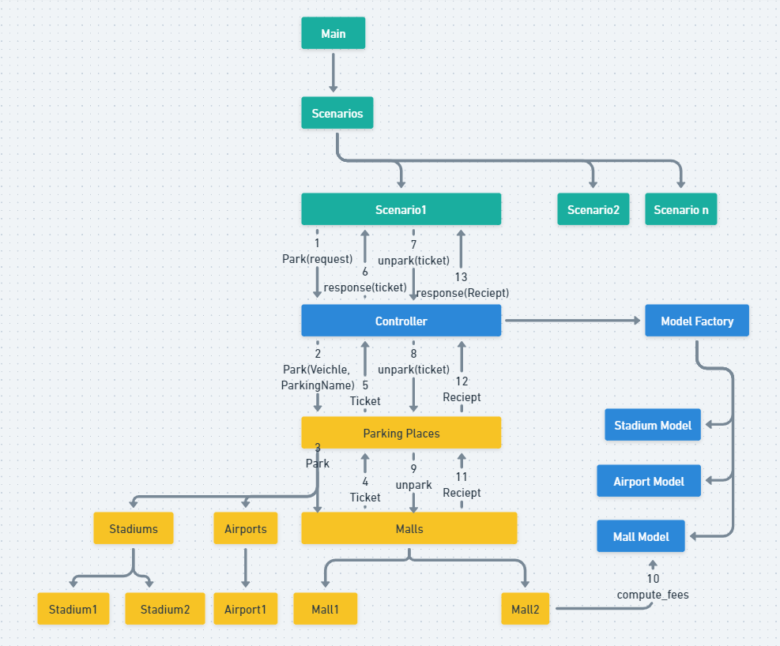
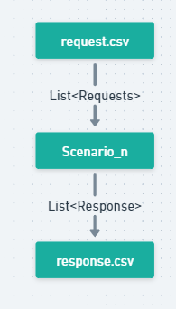

<h1 align="center"> Project Title </h1>  

  Sample microservice description.

## Table of Contents

- [Introduction](#Introduction)
- [Features](#Features)
- [Architecture](#Architecture)
- [Code Structure](#Code Structure)
- [Requirements](#Requirements)
- [Local](#Local)
- [How to run](#How to run)
- [Single Scenario flow](#Single Scenario flow)
- [Testing](#Testing)

## Introduction

This repository contains module to support parking management APIs for different parking models.

## Features

* Supports 3 kinds of parking models (Airport, Mall and Stadium).
* Initialises and maintain different parking places for different parking models based provided configurations.
* Issues parking tickets and reciepts for park/unpark requests to parking places.
* Runs different parking scenarios fpr different parking places.

## Architecture

## Code Structure
1. Data/Docs => java docs base dir ([index](Data/Docs/index.html))
2. Data/Server => All supported modles with their parking info.
3. Data/Client => All parking related events generated for different parking places.
4. Entry point => src/main/java/org/sahaj/parking/Main.java

## Requirements

### Local
* [Java 8 SDK](http://www.oracle.com/technetwork/java/javase/downloads/jdk8-downloads-2133151.html)
* [Maven](https://maven.apache.org/download.cgi)

## How to run
The application can be run locally by creating different scenarios for parking.
Execute following steps to perform one scenario,
1. copy/change model.csv for given model type (e.g. Data/Server/Models/Airport/model.csv). Dont change structure.
2. copy/change spots.csv for given parking place. add all avaialble parking spots for different veciele type. (e.g. Data/Server/ParkingPlaces/Airport/Airport1/spots.csv)
3. copy/change request.csv file to generate parking related events. (e.g. Data/Client/Events/Airport/Airport1/request.csv)
4. Run jar, command => 
5. On successful completetion of program, and output will be generated in console and response.csv (e.g. Data/Client/Events/Airport/Airport1/response.csv)

## Single Scenario flow

## Testing
1. Unit tests,
   1. Airport model => src/test/java/org/sahaj/parking/test/TestAirportModel.java
   2. Mall model => src/test/java/org/sahaj/parking/test/TestMallModel.java
   3. Stadium model => src/test/java/org/sahaj/parking/test/TestStadiumModel.java
